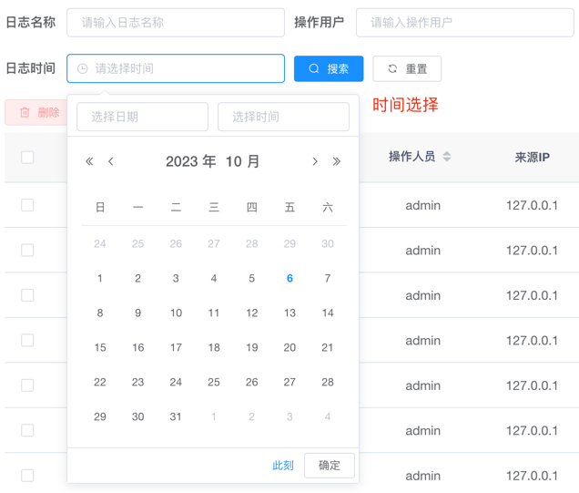

## 按钮组件

### 新增按钮（[base-add-button](https://gitee.com/dgxdks/youlan-boot/blob/master/youlan-web/src/framework/components/BaseAddButton.vue)）

* 基础用法

```vue

<base-add-button v-has-perm="['system:config:add']" plain @click="handleAdd"/>
```

### 删除按钮（[base-remove-button](https://gitee.com/dgxdks/youlan-boot/blob/master/youlan-web/src/framework/components/BaseRemoveButton.vue)）

* 基础用法

```vue

<base-remove-button v-has-perm="['monitor:onlineUser:kickout']" type="text" @click="handleKickout(scope.row)">强踢</base-remove-button>
```

### 修改按钮([base-update-button](https://gitee.com/dgxdks/youlan-boot/blob/master/youlan-web/src/framework/components/BaseUpdateButton.vue))

* 基础用法

```vue

<base-update-button v-has-perm="['system:config:update']" plain :disabled="!tableSelectOne" @click="handleUpdate"/>
```

### 搜索按钮([base-search-button](https://gitee.com/dgxdks/youlan-boot/blob/master/youlan-web/src/framework/components/BaseSearchButton.vue))

* 基础用法

```vue

<base-search-button @click="handleQuery"/>
```

### 重置按钮([base-reset-button](https://gitee.com/dgxdks/youlan-boot/blob/master/youlan-web/src/framework/components/BaseResetButton.vue))

* 基础用法

```vue

<base-reset-button @click="handleResetQuery"/>
```

### 上传按钮([base-upload-button](https://gitee.com/dgxdks/youlan-boot/blob/master/youlan-web/src/framework/components/BaseUploadButton.vue))

* 基础用法

```vue

<base-upload-button type="primary" plain @click="handleFileUpload">文件上传</base-upload-button>
```

### 下载按钮([base-download-button](https://gitee.com/dgxdks/youlan-boot/blob/master/youlan-web/src/framework/components/BaseDownloadButton.vue))

* 基础使用

```vue

<base-download-button v-has-perm="['system:config:export']" plain @click="handleExport">导出</base-download-button>
```

### 关闭按钮([base-close-button](https://gitee.com/dgxdks/youlan-boot/blob/master/youlan-web/src/framework/components/BaseCloseButton.vue))

* 基础使用

```vue

<base-close-button plain @click="handleClose">关闭</base-close-button>
```

### 文本按钮([base-text-button](https://gitee.com/dgxdks/youlan-boot/blob/master/youlan-web/src/framework/components/BaseTextButton.vue))

* 基础使用

```vue

<base-text-button
    v-has-perm="['system:role:update']"
    icon="el-icon-circle-check"
    color="#606266"
    @click="handleDataScope(scope.row)"
>
  数据权限
</base-text-button>
```

### 开关按钮([base-switch](https://gitee.com/dgxdks/youlan-boot/blob/master/youlan-web/src/framework/components/BaseSwitch.vue))

* 基础用法

```vue

<base-switch v-model="scope.row.status" :disabled="$auth.isAdminRole(scope.row.id)" @change="handleStatusChange(scope.row)"/>
```

### 菜单按钮([base-menu-button](https://gitee.com/dgxdks/youlan-boot/blob/master/youlan-web/src/framework/components/BaseMenuButton.vue))

* 基础用法

```vue

<base-menu-button>
  <base-text-button
      v-has-perm="['system:user:updatePasswd']"
      icon="el-icon-key"
      color="#606266"
      @click="handleResetPwd(scope.row)"
  >重置密码
  </base-text-button>
  <base-text-button
      v-has-perm="['system:user:update']"
      icon="el-icon-circle-check"
      color="#606266"
      @click="handleAuthRole(scope.row)"
  >分配角色
  </base-text-button>
</base-menu-button>
```

### 示例图片


## 时间组件

### 日期选择([base-date-range-picker](https://gitee.com/dgxdks/youlan-boot/blob/master/youlan-web/src/framework/components/BaseDateRangePicker.vue))

* 日期选择

```vue

<base-date-range-picker v-model="queryForm.createTime" type="date" style="width: 240px"/>
```

* 日期范围选择

```vue

<base-date-range-picker v-model="queryForm.createTimeRange" style="width: 240px"/>
```

### 时间选择([base-date-time-range-picker](https://gitee.com/dgxdks/youlan-boot/blob/master/youlan-web/src/framework/components/BaseDateTimeRangePicker.vue))

* 时间选择

```vue

<base-date-time-range-picker v-model="queryForm.loginTime" type="datetime" style="width: 240px"/>
```

* 时间范围选择

```vue

<base-date-time-range-picker v-model="queryForm.loginTimeRange" style="width: 340px"/>
```

### 示例图片

<table>
    <tbody>
        <tr>
            <td>
                
            </td>
            <td>
                
            </td>
        </tr>        
        <tr>
            <td>
                
            </td>
            <td>
                
            </td>
        </tr>
    </tbody>
</table>

## Icon组件

### 基础Icon([base-svg-icon](https://gitee.com/dgxdks/youlan-boot/blob/master/youlan-web/src/framework/components/BaseSvgIcon.vue))

> **温馨提示：** 内置Icon都存放在项目[svg](https://gitee.com/dgxdks/youlan-boot/tree/master/youlan-web/src/framework/icons/svg)目录下，不带后缀的icon文件名称就是icon-class属性值，
> 例如404.svg，则指定icon-class=“404”，icon-class则可以向组件中绑定自定义class名称

* 基础用法

```vue
<!-- 两个组件名称都指向的是同一个组件-->
<svg-icon class-name="search-icon" icon-class="search" @click.stop="click"/>
<base-svg-icon class-name="search-icon" icon-class="search" @click.stop="click"/>
```

### 内容复制Icon([base-copy-icon](https://gitee.com/dgxdks/youlan-boot/blob/master/youlan-web/src/framework/components/BaseCopyIcon.vue))

> **温馨提示：** 有时候当需要复制页面中的文本内容时会插入一个可点击的图标表示内容可复制，这个组件实现了此基础功能

* 基础用法

```vue

<base-copy-icon v-model="item.codeContent" show-message style="float:right">复制</base-copy-icon>
```

### 下拉选择Icon([base-icon-select](https://gitee.com/dgxdks/youlan-boot/blob/master/youlan-web/src/framework/components/BaseIconSelect.vue))

> **温馨提示：** 将项目内置的所有icon以下拉选择框的形式进行展示，支持选择和搜索

* 基础用法

```vue

<base-icon-select ref="iconSelect" v-model="editForm.menuIcon"/>
```

### 示例图片

<table>
    <tbody>
        <tr>
            <td>
                
            </td>
            <td>
                
            </td>
        </tr>
    </tbody>
</table>

## 数据字典组件

> **温馨提示：** 数据字典组件v-model绑定的值，数据类型都会被转为String类型，在向后端传值以及后端返回数据前端回显的时候需要注意数据类型

### 单选框([dict-radio](https://gitee.com/dgxdks/youlan-boot/blob/master/youlan-web/src/framework/components/DictRadio.vue))

```vue

<dict-radio v-model="editForm.isDefault" dict-type="db_yes_no"/>
```

### 复选框([dict-checkbox](https://gitee.com/dgxdks/youlan-boot/blob/master/youlan-web/src/framework/components/DictCheckbox.vue))

```vue

<dict-checkbox v-model="editForm.orgTypeList" dict-type="sys_org_type"/>
```

### 标签([dict-tag](https://gitee.com/dgxdks/youlan-boot/blob/master/youlan-web/src/framework/components/DictTag.vue))

```vue

<dict-tag v-model="scope.row.orgType" dict-type="sys_org_type"/>
```

### 下拉选择([dict-select](https://gitee.com/dgxdks/youlan-boot/blob/master/youlan-web/src/framework/components/DictSelect.vue))

```vue

<dict-select v-model="editForm.sex" dict-type="sys_user_sex" placeholder="请选择性别"/>
```

### 示例图片

<table>
    <tbody>
        <tr>
            <td>
                
            </td>
            <td>
                
            </td>
        </tr>
    </tbody>
</table>

## 其他组件

### 基础弹窗([base-dialog](https://gitee.com/dgxdks/youlan-boot/blob/master/youlan-web/src/framework/components/BaseDialog.vue))

* 基础用法

```vue

<base-dialog :title="editTitle" :open.sync="editOpen" width="600px" @confirm="handleEditSubmit"
             @cancel="handleEditCancel">
</base-dialog>
```

### 抽屉弹窗([base-drawer](https://gitee.com/dgxdks/youlan-boot/blob/master/youlan-web/src/framework/components/BaseDrawer.vue))

* 基础用法

```vue

<base-drawer title="存储记录详情" :open.sync="editOpen" size="80%" wrapper-closable>
  <el-form ref="editForm" :model="editForm" label-width="100px" size="mini" label-position="left" style="padding: 10px">
    <base-row-split2>
      <el-form-item label="平台名称：" prop="platform">
        {{ editForm.platform }}
      </el-form-item>
    </base-row-split2>
  </el-form>
</base-drawer>
```

### 表单标签([base-form-label](https://gitee.com/dgxdks/youlan-boot/blob/master/youlan-web/src/framework/components/BaseFormLabel.vue))

* 基础用法

```vue

<el-form ref="editForm" :model="editForm" :rules="editRules" label-width="100px">
  <el-form-item label="字典类型" prop="typeKey">
    <base-form-label slot="label" content="字典类型必须以字母开头，且只能为（小写字母，数字，下滑线）" label="字典类型"/>
    <el-input v-model="editForm.typeKey" placeholder="请输入字典类型"/>
  </el-form-item>
</el-form>
```

### 二分之一布局

### 三分之一布局

### 代码高亮([base-high-light-code](https://gitee.com/dgxdks/youlan-boot/blob/master/youlan-web/src/framework/components/BaseHighLightCode.vue))

* 基础用法

```vue

<base-high-light-code v-model="item.codeContent" :language="getVmLanguage(item.vmName)"/>
```
